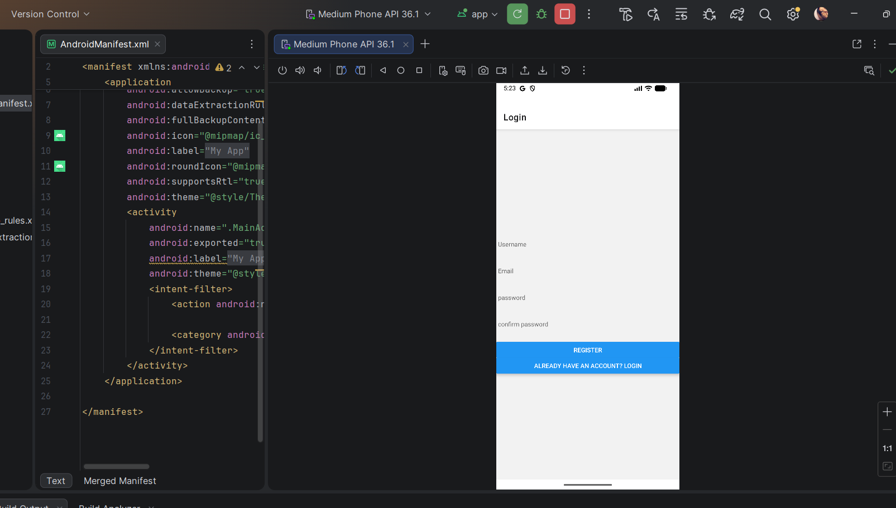
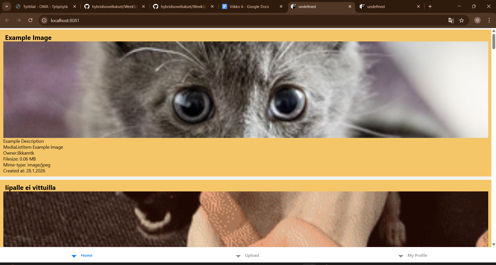
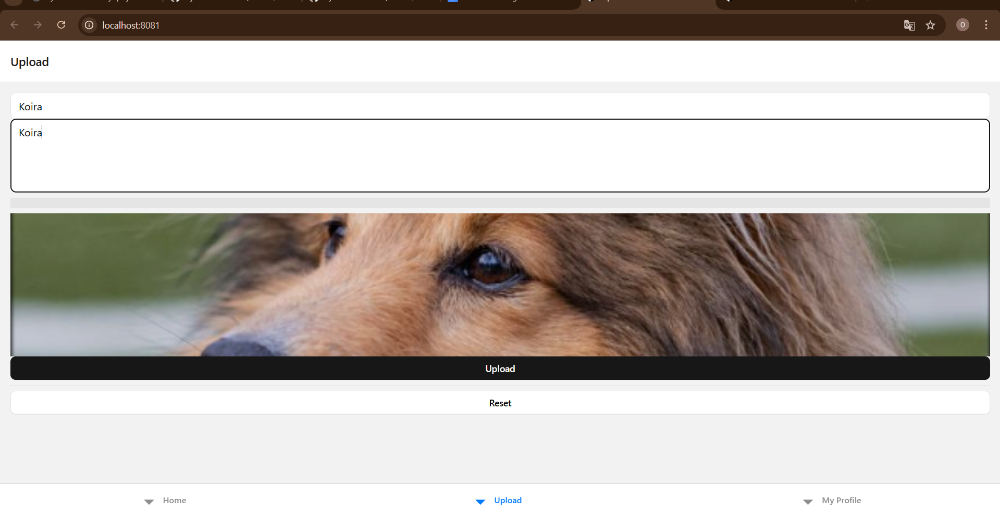

## Week 6
### Login/Regoster view in the Emulator:
  
### Home view in the website (npx expo start --web  ):
  
### Upload view in the website (npx expo start --web):
  
### Profile view in the website (npx expo start --web):

## Why the website (npx expo start --web ) was used?:
  - I couldn't fully access the expoted expo Go project in the Emulator as I was unable to use VPN in the Emulator, so I chose the   Website instead.
